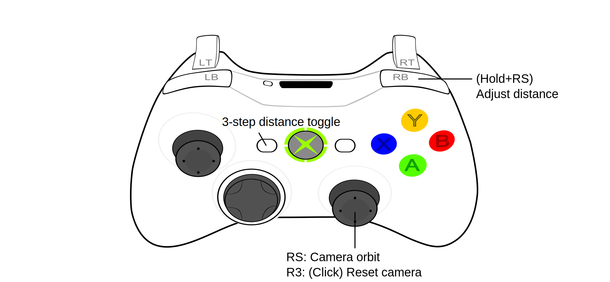

[按這打開中文說明](https://github.com/dabinn/R-Type-Final-2-UEVR/blob/main/doc/Chinese/Readme.md)
# R-Type-Final-2-UEVR
As a big fan of the R-Type series, I created this dedicated UEVR plugin to enhance the experience.

# Demo Video

# Main Features
This plugin originally started as a simple tool to automatically switch camera positions to solve issues in different scenes, such as:
- Zooming the camera in during gameplay (the default is just too far).
- Avoiding visual glitches caused by the headset during the opening animation.

Later, after developing a universal camera plugin, I redesigned this plugin to leverage its features.
Now, you can enjoy all the features of the universal camera plugin, such as **free camera**, **time manipulation**, etc. (For detailed instructions, please refer to the [Universal Free Camera Plugin](https://github.com/dabinn/UEVR-Universal-Free-Camera/); I won't repeat them here.)
  
There are also extra custom features specifically for R-Type Final 2, such as:
- **Orbit Camera**: You can adjust the view at any time with `Right analog stick`, even during gameplay.
- **In-game camera switch**: Easily switch between three different camera positions during gameplay! (Use the `Select` button). Several comfortable default positions have been fine-tuend for different scenes.
- **Camera distance adjustment**:You can also hold the `RB button` and push the `right stick` forward/backward anytime to adjust the camera distance, it is very convenient!

- **Enhanced scene detection**: The plugin detects and improves controls for different scenes such as gameplay, cutscenes, hangar, decal mode, etc.
- **Other Fixes**: e.g. Fixed the issue where UEVR couldn't control the camera in decal mode.

# Installation
Import this configuration file in the UEVR interface, then restart the game.  
Or you can manually extract the zip file and place it in the game's script directory.

