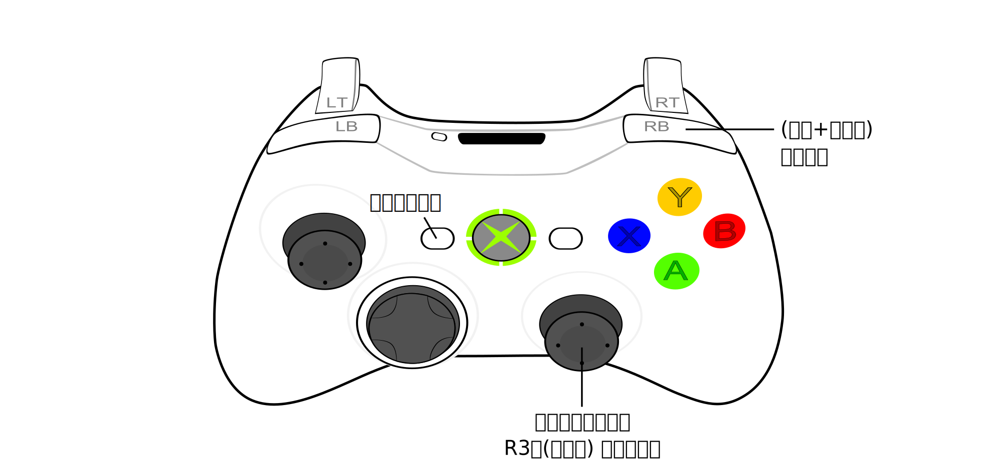

# R-Type-Final-2-UEVR
身為R-Type系列的愛好者，所以我幫他做了UEVR的專用插件。

# 示範影片

# 主要功能
這插件最早的時候只是簡單的自動切換攝影機位置，以解決不同場景下的問題，例如：
- 在遊戲過程中拉近攝影機 (預設的實在是太遠了)。
- 在開場動畫中避免頭盔造成的破圖。  

後來我做了通用攝影機插件，所以這插件就再度改寫了。
除了可以享用到通用攝影機插件的所有功能，例如**自由攝影機**、**時間變速**..等。(詳細說明請參考 [通用自由攝影機插件](https://github.com/dabinn/UEVR-Universal-Free-Camera/blob/main/doc/Chinese/Readme.md) ，我就不在這重覆寫了)
並且還有一些額外針對R-Type Final 2的客製化功能，像是：
- **環繞攝影機**：直接用`右蘑菇頭`操作！即使在遊戲中也可隨時變動視角。
- **即時攝影機切換**：`Select鍵`可切換3組攝影機，且不同場景下都已經調整幾組舒服的預設位置。
- **即時距離調整**：遊戲進行中也可以直接按住RB鍵+前後推動右搖桿來調整攝影機距離，微調非常的方便！

- **遊戲場景偵測加強**：遊戲進行中、過場動畫、機庫、貼紙模式等不同場景，都被插件偵測並強化操作方式。
- **其它修正**：例如，修正了原本UEVR沒法在貼紙模式控制攝影機的問題。

# 安裝
在UEVR介面中匯入這個配置檔，然後重新啟動遊戲即可。
或者你也可以手動解壓縮zip檔，然後把它放進遊戲的script目錄裏。
